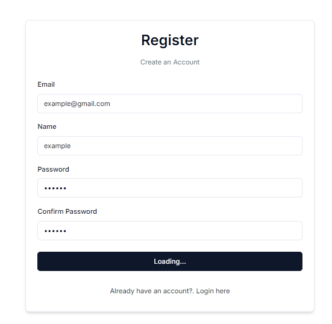

### Create Next.js Application
First, we'll create a new Next.js project. Run the following command:
```bash
npx create-next-app@latest
```
Answer the prompts as follows:
- Project name: `register-form-project`
- Using TypeScript: Yes
- ESLint: Yes
- Tailwind CSS: Yes
- Source directory: No
- App router: Yes
- Custom import alias: No

After the setup, navigate into your project directory and open it in VS Code:
```bash
cd register-form-project
code .
```

### Install & Initialize Shadcn/UI
Next, we'll install and initialize Shadcn:
1. Go to [shadcn/ui](https://ui.shadcn.com) and follow the installation instructions for Next.js.
2. Run the CLI to initialize Shadcn in your project:
    ```bash
    npx shadcn@latest init
    ```
3. Choose the default style and set the base color to slate.
4. Choose to use CSS variables for colors.

### Add Required Components from Shadcn/UI
Install the necessary components using the CLI:
```bash
npx shadcn@latest add button card form input
```
These components will be added to your project under the `components` directory.

### Organize File and Folder Structure
1. Clean up the default `index.tsx` file.
2. Create a new folder structure under `app` for authentication pages:
    ```bash
    app/
    ├── auth/
    │   ├── login/
    │   │   └── page.tsx
    │   ├── register/
    │   │   └── page.tsx
    ```

3. Create a reusable `CardWrapper` component:
    ```tsx
    // components/CardWrapper.tsx
    import { Card, CardContent, CardHeader, CardFooter } from 'shadcn-ui';

    interface CardWrapperProps {
        label: string;
        title: string;
        backButtonHref: string;
        backButtonLabel: string;
        children: React.ReactNode;
    }

    const CardWrapper: React.FC<CardWrapperProps> = ({ label, title, backButtonHref, backButtonLabel, children }) => {
        return (
            <Card className="w-1/4 md:w-1/3 shadow-md">
                <CardHeader>
                    <h1 className="text-3xl font-semibold">{title}</h1>
                    <p className="text-sm text-muted-foreground">{label}</p>
                </CardHeader>
                <CardContent>
                    {children}
                </CardContent>
                <CardFooter>
                    <a href={backButtonHref} className="text-blue-500">{backButtonLabel}</a>
                </CardFooter>
            </Card>
        );
    }

    export default CardWrapper;
    ```

4. Create a layout file for the `auth` folder:
    ```tsx
    // app/auth/layout.tsx
    const AuthLayout: React.FC<{ children: React.ReactNode }> = ({ children }) => {
        return (
            <section className="w-full h-screen flex items-center justify-center">
                {children}
            </section>
        );
    }

    export default AuthLayout;
    ```

5. Wrap the `register` and `login` pages with the `CardWrapper` component and the layout.

### Create the Register Form
1. Create the `RegisterForm` component:
    ```tsx
    // components/RegisterForm.tsx
    import React from 'react';
    import CardWrapper from './CardWrapper';

    const RegisterForm: React.FC = () => {
        return (
            <CardWrapper
                label="Create an account"
                title="Register"
                backButtonHref="/auth/login"
                backButtonLabel="Already have an account? Log in here"
            >
                {/* Form content will go here */}
            </CardWrapper>
        );
    }

    export default RegisterForm;
    ```

2. Integrate the `RegisterForm` into the `register/page.tsx`:
    ```tsx
    // app/auth/register/page.tsx
    import RegisterForm from '../../../components/RegisterForm';

    const RegisterPage: React.FC = () => {
        return <RegisterForm />;
    }

    export default RegisterPage;
    ```

### Styling and Form Functionality
1. Style the form using Tailwind CSS.
2. Implement the form functionality using react-hook-form and zod for validation.

---
# Creating a Form with Zod & React Hook Form

## Step 1: Define the Form Schema

The first step in creating a form is defining the schema using the Zod library. In the root layer of your project, create a folder named `schema` and within it, create a file called `index.ts`. In this file, define your registration schema as follows:

```typescript
import * as Z from 'zod';

export const registerSchema = Z.object({
    email: Z.string().email({ message: "Please enter a valid email address" }),
    name: Z.string().min(1, { message: "Please enter your name" }),
    password: Z.string().min(6, { message: "Password must be at least 6 characters long" }),
    confirmPassword: Z.string().min(6, { message: "Password must be at least 6 characters long" })
});
```

The schema ensures the user inputs valid data for email, name, password, and password confirmation fields. Custom error messages are provided for each validation rule.

## Step 2: Create the Form Using React Hook Form

Next, we need to define the form using the `useForm` hook from `react-hook-form`. Import the necessary libraries and set up the form as follows:

```typescript
"use client"


import CardWrapper from "./card-wrapper"
import { Form,
  FormDescription,
  FormControl,
  FormField,
  FormItem,
  FormMessage,
  FormLabel
 } from "@/components/ui/form"

 import { RegisterSchema } from "@/schema"
import { zodResolver } from "@hookform/resolvers/zod"
 import {useForm} from "react-hook-form"
import { Input } from "../ui/input"
import { Button } from "../ui/button"
import { z } from "zod"
import { useFormStatus } from "react-dom"
import { useState } from "react"
 
 


const RegisterForm = () => {

  const [loading, setLoading] = useState(false);

//creating a form using 'react-hook-form'
const form = useForm({
  resolver: zodResolver(RegisterSchema),
  defaultValues: {
     email: "",
     name: "",
     password: "",
     confirmPassword: "",
  }

});
```

The `useForm` hook takes an object with `resolver` and `defaultValues` properties. The `resolver` function allows you to use Zod for validation, while `defaultValues` initializes the form fields.

## Step 3: Create the Form Component

Now, create the form component that will render the input fields and handle form submission:

```typescript
const onSubmit = (data: z.infer<typeof RegisterSchema>) => {
  setLoading(true);
  console.log(data);
}


const {pending} = useFormStatus();

  return (
    <CardWrapper
    label = "Create an Account"
    title = "Register"
    backButtonHref = "/auth/login"
    backButtonLabel = "Already have an account?. Login here"
    >
    <Form {...form}>
      {/* note the callback function onSubmit within the handleSubmit metho will be triggered only when the form is successfully validated*/}
      <form onSubmit={form.handleSubmit(onSubmit)} className="space-y-6">
        <div className="space-y-4">
        
        {/* the FormField component takes in 3 props control, render and name
        control is used to access the form methods
         <!--
          * 3 props for FormField component
          * 1. control: this is used to access the form methods
            this is responsible for controlling the form state and validation.
          * 2. render: this is a callback function that takes in the formMethods and the provided name and returns the JSX for the field
          * 3. name: this is used to identify the field and access its values in the form context
          -->
         

        */}
          <FormField
          control={form.control}
          name="email"
          render={({ field }) => (
            <FormItem>
              <FormLabel>Email</FormLabel>
              <FormControl>
                <Input {...field} type="email" placeholder="Enter your email"/>
              </FormControl>
               {/* <!-- FormMessage is used to display error messages -->  */}
              <FormMessage />
            </FormItem>
            
          )}
          
          />
          <FormField
          control={form.control}
          name="name"
          render={({ field }) => (
            <FormItem>
              <FormLabel>Name</FormLabel>
              <FormControl>
                <Input {...field}  placeholder="Enter your name"/>
              </FormControl>
              <FormMessage />
            </FormItem>
            
          )}
          
          />
          <FormField
          control={form.control}
          name="password"
          render={({ field }) => (
            <FormItem>
              <FormLabel>Password</FormLabel>
              <FormControl>
                <Input {...field} type="password"  placeholder="Enter your password"/>
              </FormControl>
              <FormMessage />
            </FormItem>
            
          )}
          
          />
          <FormField
          control={form.control}
          name="confirmPassword"
          render={({ field }) => (
            <FormItem>
              <FormLabel>Confirm Password</FormLabel>
              <FormControl>
                <Input {...field} type="password"  placeholder="Enter password again"/>
              </FormControl>
              <FormMessage />
            </FormItem>
            
          )}
          
          />

        </div>
        <Button className="w-full" type="submit" disabled={pending} >
          {loading ? "Loading..." : "Register"}
          
          
          </Button>
      
      </form>

    </Form>

    </CardWrapper>
  )
}

export default RegisterForm
```

This component includes input fields for email, name, password, and password confirmation, along with corresponding error messages.

## Step 4: Add Client-Side Validation and Submit Handler

Implement the submit handler and validation logic:

```typescript
const onSubmit = (data) => {
    console.log(data);
};
```

When the form is submitted, the data will be logged to the console if all validations pass.

## Creating a Login Form

To create a login form, follow similar steps as the registration form but with fewer fields. Define a login schema in `schema/index.ts`:

```typescript
export const loginSchema = Z.object({
    email: Z.string().email({ message: "Please enter a valid email address" }),
    password: Z.string().min(6, { message: "Password must be at least 6 characters long" })
});
```

In your `LoginForm` component, use the `useForm` hook with the `loginSchema`:

```typescript
const onSubmit = (data: z.infer<typeof RegisterSchema>) => {
  setLoading(true);
  console.log(data);
}


const {pending} = useFormStatus();

  return (
    <CardWrapper
    label = "Create an Account"
    title = "Register"
    backButtonHref = "/auth/login"
    backButtonLabel = "Already have an account?. Login here"
    >
    <Form {...form}>
      {/* note the callback function onSubmit within the handleSubmit metho will be triggered only when the form is successfully validated*/}
      <form onSubmit={form.handleSubmit(onSubmit)} className="space-y-6">
        <div className="space-y-4">
        
        {/* the FormField component takes in 3 props control, render and name
        control is used to access the form methods
         <!--
          * 3 props for FormField component
          * 1. control: this is used to access the form methods
            this is responsible for controlling the form state and validation.
          * 2. render: this is a callback function that takes in the formMethods and the provided name and returns the JSX for the field
          * 3. name: this is used to identify the field and access its values in the form context
          -->
         

        */}
          <FormField
          control={form.control}
          name="email"
          render={({ field }) => (
            <FormItem>
              <FormLabel>Email</FormLabel>
              <FormControl>
                <Input {...field} type="email" placeholder="Enter your email"/>
              </FormControl>
               {/* <!-- FormMessage is used to display error messages -->  */}
              <FormMessage />
            </FormItem>
            
          )}
          
          />
          <FormField
          control={form.control}
          name="name"
          render={({ field }) => (
            <FormItem>
              <FormLabel>Name</FormLabel>
              <FormControl>
                <Input {...field}  placeholder="Enter your name"/>
              </FormControl>
              <FormMessage />
            </FormItem>
            
          )}
          
          />
          <FormField
          control={form.control}
          name="password"
          render={({ field }) => (
            <FormItem>
              <FormLabel>Password</FormLabel>
              <FormControl>
                <Input {...field} type="password"  placeholder="Enter your password"/>
              </FormControl>
              <FormMessage />
            </FormItem>
            
          )}
          
          />
          <FormField
          control={form.control}
          name="confirmPassword"
          render={({ field }) => (
            <FormItem>
              <FormLabel>Confirm Password</FormLabel>
              <FormControl>
                <Input {...field} type="password"  placeholder="Enter password again"/>
              </FormControl>
              <FormMessage />
            </FormItem>
            
          )}
          
          />

        </div>
        <Button className="w-full" type="submit" disabled={pending} >
          {loading ? "Loading..." : "Register"}
          
          
          </Button>
      
      </form>

    </Form>

    </CardWrapper>
  )
}

export default RegisterForm
```

## Adding Loading State and Button Disable

To enhance the user experience, use the `useFormStatus` hook to manage the form's loading state and disable the submit button when the form is pending:

```typescript
import { useFormStatus } from 'react-hook-form';

const { pending } = useFormStatus();

return (
    <Button className="w-full" type= "submit" disabled={pending}>
          
           {loading ? <p>Loading...</p> : "Login"}
          
          </Button>
);
```

This addition ensures that the button displays a loading state and is disabled while the form is being submitted.

By following these steps, you can create robust forms with client-side validation using Zod and React Hook Form. This setup ensures a great user experience by providing real-time feedback and preventing invalid data submission.
